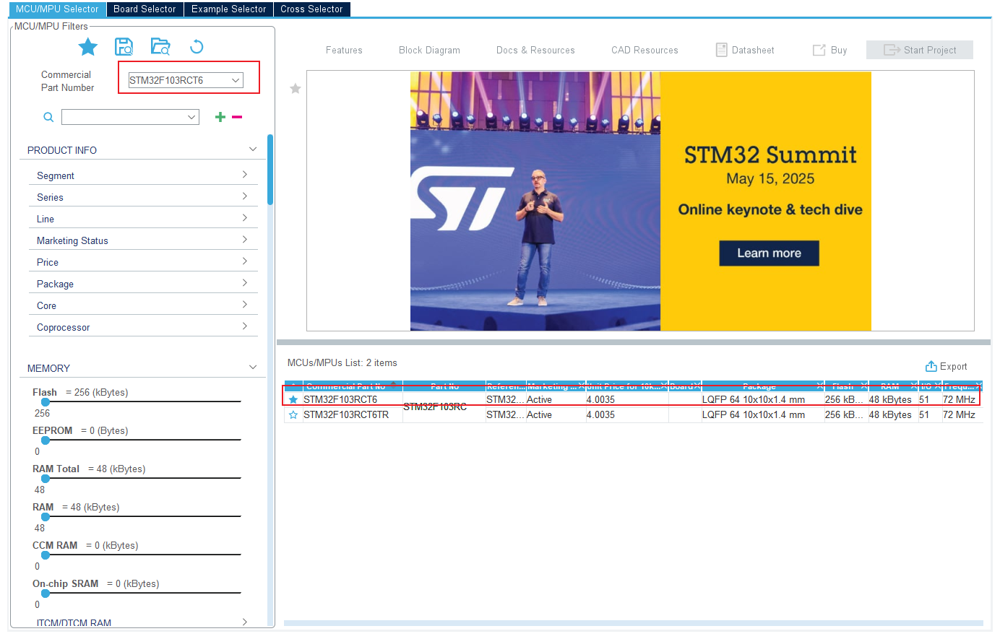
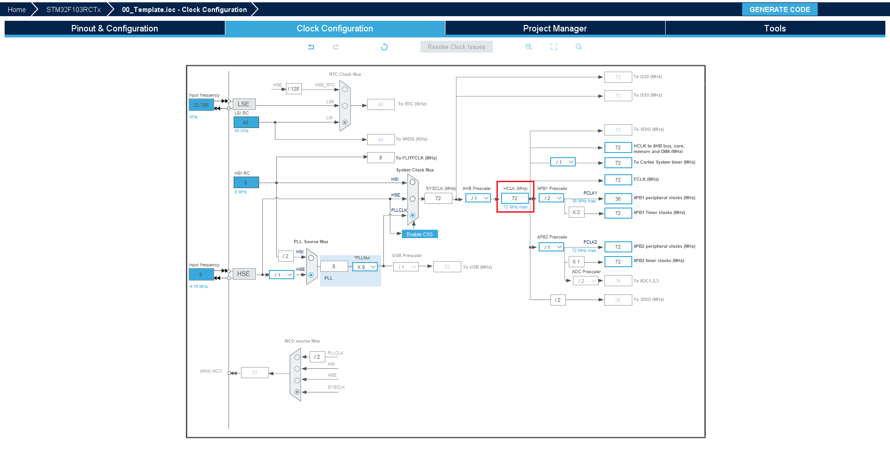
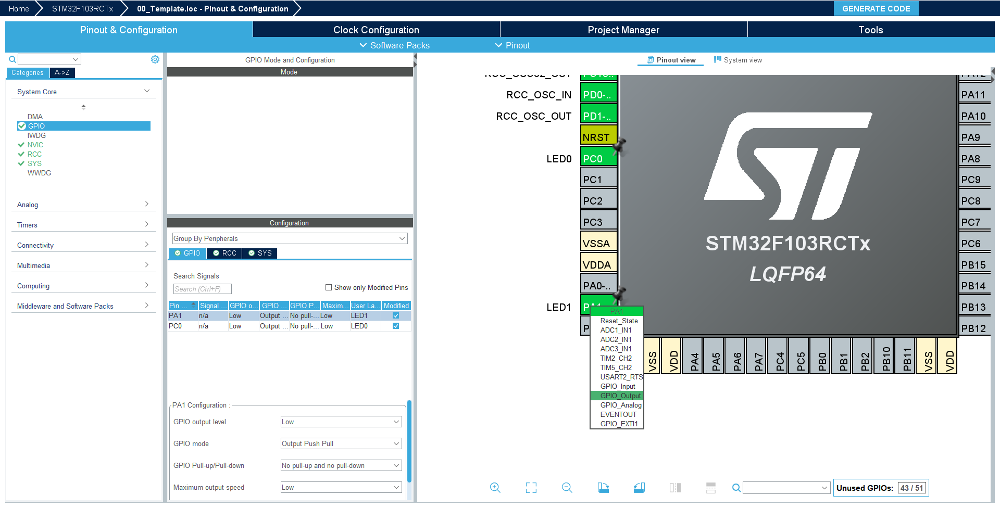

# 第3章 模板工程构建

本章节以点亮LED为例，学习使用STM32CubeMX创建工程，生成代码，并在Clion中进行代码编辑，编译，下载和调试。

## 3.1 创建SMT32CubeMX工程
根据使用的芯片型号创建工程，这里使用的STM32F103RCT6,直接进行搜索，并且收藏这个型号，后续创建工程可直接点击收藏的型号，就不需要搜索了。


按照下图配置工程的一些属性, 其中工程名称和路径不要有中文


配置完成后， Ctrl+S 保存工程，工程保存后路径是不可以更改的。

## 3.2 工程配置

### 3.2.1 时钟配置
我们的开发板使用的外部晶振（高速和低速）提供时钟源，所以RCC都配置成外部时钟源。


时钟树配置，直接输入72(STM32F1系列的时钟最高是72MHz), 然后回车，各个总线上的时钟就会自动配置。



### 3.2.2 IO配置

#### SWD调试IO口配置
根据使用的下载方式选择，我们使用的是SWD,选择下图所示的模式。


#### 普通IO配置
普通IO，也就是连接外设需要使用的IO，以下是配置的两个通用IO(GPIO)，用于控制LED, 具体配置哪些IO需要根据硬件原理图配置。



控制LED，IO模式都配置成输出模式，并且给对应IO进行命名。


## 3.3 代码

### 3.3.1 生成代码
配置完成后，点击右上角的 "GENERATE CODE" 即可生成代码。


### 3.3.2 工程结构

```bash
./00_Template
│  00_Template.ioc
│  CMakeLists.txt
│  .mxproject
│  CMakePresets.json
│  startup_stm32f103xe.s
│  STM32F103XX_FLASH.ld
│  
├─cmake
│    
├─Core
│  ├─Inc  
│  └─Src
│          
└─Driverse
    ├─CMSIS     
    └─STM32F1xx_HAL_Driver                
```
几个主要的文件(夹)：

- `00_Template.ioc` SMT32CubeMX工程文件，其他所有文件都是有这个文件生成的，如果需要复用工程，只需要复制这个文件，重新生成代码即可。

- `CMakeLists.txt` 工程的CMAKE文件，只有生成cmake和STM32CubeIDE工程才会有cmake文件。

- `cmake`：cmake 子文件，在根目录的cmake会包含该目录下的cmake

- `Core`: 核心代码，在STM32CubeMX中对IO配置的代码都申城在该文件夹下。

- `Drivers`: STM32的HAL库驱动代码。


## 3.4 编译、下载、调试

### 3.4.1 使用CLion
使用CLion 打开工程，第一次打开会自动扫描Cmake文件并生成编译配置，如果没有生成，可使用CLion重新打开工程。
打开工程之后，点击编译按钮，编译没有错误


### 3.4.2 调整目录结构

在工程目录下添加 `App` 和 `Bsp` 两个文件夹， 在两个文件夹中分别创建 `Inc`和`Src`文件夹。并且修改根目录下的`CMakeLists.txt` 文件， 修改完成后需要重新加载一下工程。
其中`App` 文件夹存放用户业务代码， `Bsp`文件夹存放外设驱动代码。


`CMakeLists.txt` 完整内容 ：
```cmake
cmake_minimum_required(VERSION 3.22)

#
# This file is generated only once,
# and is not re-generated if converter is called multiple times.
#
# User is free to modify the file as much as necessary
#

# Setup compiler settings
set(CMAKE_C_STANDARD 11)
set(CMAKE_C_STANDARD_REQUIRED ON)
set(CMAKE_C_EXTENSIONS ON)


# Define the build type
if(NOT CMAKE_BUILD_TYPE)
    set(CMAKE_BUILD_TYPE "Debug")
endif()

# Set the project name
set(CMAKE_PROJECT_NAME 00_Template)

# Include toolchain file
include("cmake/gcc-arm-none-eabi.cmake")

# Enable compile command to ease indexing with e.g. clangd
set(CMAKE_EXPORT_COMPILE_COMMANDS TRUE)

# Core project settings
project(${CMAKE_PROJECT_NAME})
message("Build type: " ${CMAKE_BUILD_TYPE})

# Enable CMake support for ASM and C languages
enable_language(C ASM)

# Create an executable object type
add_executable(${CMAKE_PROJECT_NAME})

# Add STM32CubeMX generated sources
add_subdirectory(cmake/stm32cubemx)

# Link directories setup
target_link_directories(${CMAKE_PROJECT_NAME} PRIVATE
    # Add user defined library search paths
)

# add user source file
file(GLOB_RECURSE USER_SOURCES
        ./Bsp/*.*
        ./App/*.*
)

# Add sources to executable
target_sources(${CMAKE_PROJECT_NAME} PRIVATE
        # Add user sources here
        ${USER_SOURCES}
)

# Add include paths
target_include_directories(${CMAKE_PROJECT_NAME} PRIVATE
        # Add user defined include paths
        ./Bsp/Inc
        ./App/Inc
)

# Add project symbols (macros)
target_compile_definitions(${CMAKE_PROJECT_NAME} PRIVATE
    # Add user defined symbols
)

# Add linked libraries
target_link_libraries(${CMAKE_PROJECT_NAME}
    stm32cubemx

    # Add user defined libraries
)

```

分别在`./App/Inc` 和 `./App/Src/`下创建 `app.h`和`app.c`文件， 具体内容如下：
```c
// ./App/Inc/app.h
#ifndef __APP_H
#define __APP_H

#include "main.h"

void app_main(void);

#endif //APP_H

// ./App/Src/app.c
#include "app.h"

void app_main(void)
{
    while (1)
    {
        HAL_GPIO_WritePin(LED1_GPIO_Port, LED1_Pin, GPIO_PIN_RESET);
        HAL_Delay(500);
    }
}

```

在 `./Core/Src/main.c`中调用 `app_main()`
```c
int main(void)
{

  /* USER CODE BEGIN 1 */

  /* USER CODE END 1 */

  /* MCU Configuration--------------------------------------------------------*/

  /* Reset of all peripherals, Initializes the Flash interface and the Systick. */
  HAL_Init();

  /* USER CODE BEGIN Init */

  /* USER CODE END Init */

  /* Configure the system clock */
  SystemClock_Config();

  /* USER CODE BEGIN SysInit */

  /* USER CODE END SysInit */

  /* Initialize all configured peripherals */
  MX_GPIO_Init();
  /* USER CODE BEGIN 2 */
  app_main();
  /* USER CODE END 2 */

  /* Infinite loop */
  /* USER CODE BEGIN WHILE */
  while (1)
  {
    /* USER CODE END WHILE */

    /* USER CODE BEGIN 3 */
  }
  /* USER CODE END 3 */
}
```

### 3.4.3 下载、调试
CLion从2025.1.1版本开始原生支持stlink和jlink,只需要添加stlink的编译配置，然后点击运行就可以烧录到开发板。


### 3.4.4 使用OPenOCD下载(可选)
CLion集成的stlink和jlink下载功能对下载器要求比较严格，一些非正版或是固件比较老的下载器会出现无法下载的问题。
而OPenOCD的兼容性更好，关于OPenOCD的配置参考：
