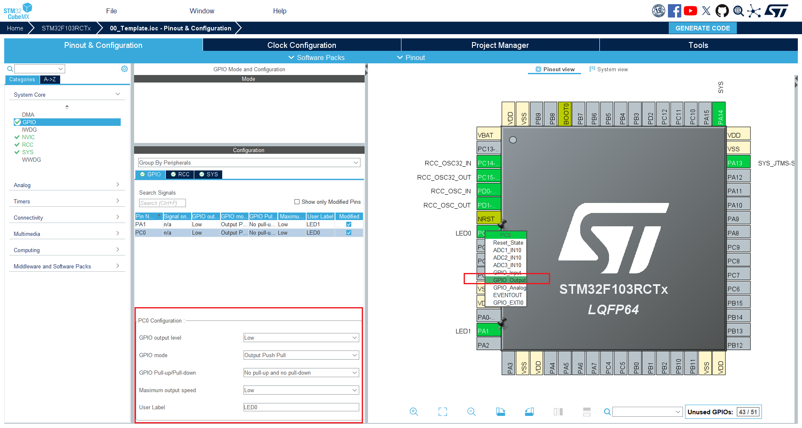

# 第4章 GPIO——点亮LED

例程效果:

- LED1 常亮
- LED2 闪烁

## 4.1 工程配置


普通的LED通常是直连stm32的引脚，IO的驱动能力足够点亮一个LED，根据原理图，PC0-LED1, PA1-LED2，配置IO，LED通常是按下图配置。



**配置参数：**   

- `GPIO output level`: 初始输出电平，可选高电平(High)，低电平(Low)  
- `GPIO mode`: GPIO 模式， 推挽输出(Output Push Pull)和开漏输出(Output Open Drain)  
- `GPIO Pull-up/Pull-down`: 上拉或下拉   
- `Maximum output speed`: IO速度   
- `User Label`: 用户标签，给IO取一个别名   


## 4.2 代码

### 4.2.1 IO配置代码
生成的IO配置代码在 `./Core/Src/gpio.c` 文件中， 下面是配置IO的主要代码:
```c
void MX_GPIO_Init(void)
{

  GPIO_InitTypeDef GPIO_InitStruct = {0};

  /* GPIO Ports Clock Enable */
  __HAL_RCC_GPIOC_CLK_ENABLE();
  __HAL_RCC_GPIOD_CLK_ENABLE();
  __HAL_RCC_GPIOA_CLK_ENABLE();

  /*Configure GPIO pin Output Level */
  HAL_GPIO_WritePin(LED0_GPIO_Port, LED0_Pin, GPIO_PIN_RESET);

  /*Configure GPIO pin Output Level */
  HAL_GPIO_WritePin(LED1_GPIO_Port, LED1_Pin, GPIO_PIN_RESET);

  /*Configure GPIO pin : LED0_Pin */
  GPIO_InitStruct.Pin = LED0_Pin;
  GPIO_InitStruct.Mode = GPIO_MODE_OUTPUT_PP;
  GPIO_InitStruct.Pull = GPIO_NOPULL;
  GPIO_InitStruct.Speed = GPIO_SPEED_FREQ_LOW;
  HAL_GPIO_Init(LED0_GPIO_Port, &GPIO_InitStruct);

  /*Configure GPIO pin : LED1_Pin */
  GPIO_InitStruct.Pin = LED1_Pin;
  GPIO_InitStruct.Mode = GPIO_MODE_OUTPUT_PP;
  GPIO_InitStruct.Pull = GPIO_NOPULL;
  GPIO_InitStruct.Speed = GPIO_SPEED_FREQ_LOW;
  HAL_GPIO_Init(LED1_GPIO_Port, &GPIO_InitStruct);

}
```
这些配置对应的就是我们在STM32CubeMx中设置的配置参数，其中引脚号和端口号会使用自定义的标签宏替代，在 `./Core/Src/main.c`中会调用`MX_GPIO_Init()`进行IO初始化。

### 4.2.1 IO操作常用函数
对IO操作的函数主要有三个，读，写，反转和毫秒延时函数。
####  读IO `GPIO_PinState HAL_GPIO_ReadPin(GPIO_TypeDef *GPIOx, uint16_t GPIO_Pin)` 
- 功能：读取指定IO口当前的电平
- 参数1： 端口
- 参数2： 引脚号
- 返回值：读取到的IO电平


#### 写IO `void HAL_GPIO_WritePin(GPIO_TypeDef *GPIOx, uint16_t GPIO_Pin, GPIO_PinState PinState)` 
- 功能： 向指定IO输出高/低电平
- 参数1： 端口
- 参数2： 引脚号
- 参数3： 写入的高/低电平


#### 反转IO输出状态 `void HAL_GPIO_TogglePin(GPIO_TypeDef *GPIOx, uint16_t GPIO_Pin)` 
- 功能： 反转指定IO输出的电平
- 参数1： 端口
- 参数2: 引脚号
  
#### 毫秒延时 `void HAL_Delay(uint32_t Delay)` 
- 功能： 延时函数
- 参数1：延时时间(毫秒)


### 4.2.2 LED驱动代码
分别在`./Bsp/Inc` 、`./Bsp/Src` 目录下创建 `led.h` 和 `led.c` 文件，文件内容如下:
```c
// led.h
#ifndef __LED_H
#define __LED_H

#include "main.h"

#define LED1_ON()       HAL_GPIO_WritePin(LED1_GPIO_Port, LED1_Pin, GPIO_PIN_RESET)
#define LED1_OFF()      HAL_GPIO_WritePin(LED1_GPIO_Port, LED1_Pin, GPIO_PIN_SET)
#define LED2_ON()       HAL_GPIO_WritePin(LED2_GPIO_Port, LED2_Pin, GPIO_PIN_RESET)
#define LED2_OFF()      HAL_GPIO_WritePin(LED2_GPIO_Port, LED2_Pin, GPIO_PIN_SET)
#define LED1_TOGGLE()     HAL_GPIO_TogglePin(LED1_GPIO_Port, LED1_Pin)
#define LED2_TOGGLE()     HAL_GPIO_TogglePin(LED2_GPIO_Port, LED2_Pin)


#endif //__LED_H


// led.c
#include "led.h"
```

因为LED的驱动逻辑就是输出高低电平控制亮灭，所以我们就只定义了几个开关led的宏，在`.c` 文件中并没有实际的函数定义。

### 4.2.3 主函数
主函数 `./App/Inc/app.h` 和 `./App/Src/app.c`内容
```c
// app.h
#ifndef __APP_H
#define __APP_H
#include "main.h"
#include "led.h"

void app_main(void);

#endif //__APP_H

// app.c
#include "app.h"

void app_main(void)
{
    while (1) {
        LED1_TOGGLE();
        LED2_ON();
        HAL_Delay(500);
    }
}

```


### 4.2.4 自定义微秒延时函数
下面的微秒延时使用了DWT(DataWatchpoint andTrace)，DWT是Cortex-M内核的资源，所以下面代码对于大部分Cortex-M内核的MCU都是适用的。

```c
// ./Core/Inc/main.h
/* Private includes ----------------------------------------------------------*/
/* USER CODE BEGIN Includes */
uint32_t DWT_Delay_Init(void);
void DWT_Delay_us(volatile uint32_t microseconds);
/* USER CODE END Includes */

/* USER CODE BEGIN Private defines */
#define HAL_Delay_us(us)   DWT_Delay_us(us)
/* USER CODE END Private defines */


// ./Core/Src/main.c

/* USER CODE BEGIN 4 */

/**
 * @brief  Initializes DWT_Clock_Cycle_Count for DWT_Delay_us function
 * @return Error DWT counter
 *         1: clock cycle counter not started
 *         0: clock cycle counter works
 */
uint32_t DWT_Delay_Init(void) {
    /* Disable TRC */
    CoreDebug->DEMCR &= ~CoreDebug_DEMCR_TRCENA_Msk; // ~0x01000000;
    /* Enable TRC */
    CoreDebug->DEMCR |=  CoreDebug_DEMCR_TRCENA_Msk; // 0x01000000;

    /* Disable clock cycle counter */
    DWT->CTRL &= ~DWT_CTRL_CYCCNTENA_Msk; //~0x00000001;
    /* Enable  clock cycle counter */
    DWT->CTRL |=  DWT_CTRL_CYCCNTENA_Msk; //0x00000001;

    /* Reset the clock cycle counter value */
    DWT->CYCCNT = 0;

    /* 3 NO OPERATION instructions */
    __ASM volatile ("NOP");
    __ASM volatile ("NOP");
    __ASM volatile ("NOP");

    /* Check if clock cycle counter has started */
    if(DWT->CYCCNT)
    {
        return 0; /*clock cycle counter started*/
    }
    else
    {
        return 1; /*clock cycle counter not started*/
    }
}

/**
 * @brief  This function provides a delay (in microseconds)
 * @param  microseconds: delay in microseconds
 */
void DWT_Delay_us(volatile uint32_t microseconds)
{
    uint32_t clk_cycle_start = DWT->CYCCNT;

    /* Go to number of cycles for system */
    microseconds *= (HAL_RCC_GetHCLKFreq() / 1000000);

    /* Delay till end */
    while ((DWT->CYCCNT - clk_cycle_start) < microseconds);
}
/* USER CODE END 4 */

```


