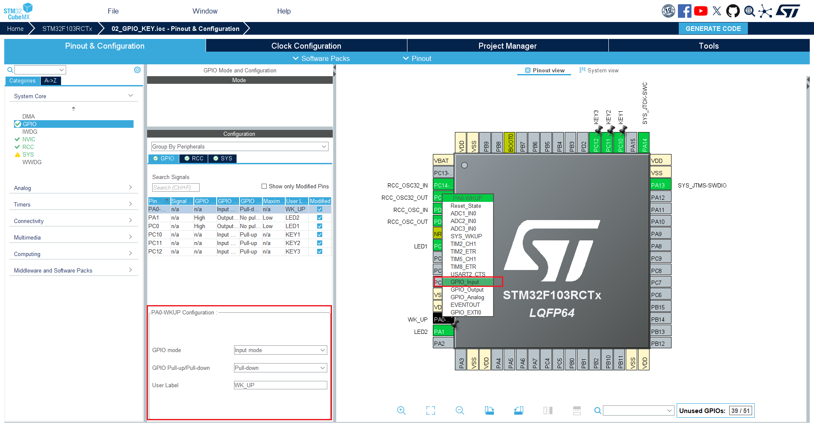

# 第5章 GPIO——按键输入

本章视频： 

例程效果：

- 按下KEY1, LED1 状态反转
- 按下KEY2, LED2 状态反转
- 按下KEY3, LED1和LED2状态反转
- 按下Wk_UP，蜂鸣器状态反转

## 5.1 工程配置

按照硬件连接，将按键连接的IO配置成输入模式, 上下拉模式需要根据硬件设计来设置，开发板上`WK_UP`按键一端连接的是3.3V,需要设置成下拉模式，其他三个按键连接的是GND,设置成上拉模式。除了四个按键的引脚配置，还需要配置LED，LED和上一章的配置一样。



## 5.2 代码

### 5.2.1 配置代码
自动生成的按键部分GPIO配置代码
```c
// ./Core/Src/gpio.c  部分代码

void MX_GPIO_Init(void)
{

  GPIO_InitTypeDef GPIO_InitStruct = {0};

  /* GPIO Ports Clock Enable */
  __HAL_RCC_GPIOC_CLK_ENABLE();
  __HAL_RCC_GPIOA_CLK_ENABLE();


  /*Configure GPIO pin : WK_UP_Pin */
  GPIO_InitStruct.Pin = WK_UP_Pin;
  GPIO_InitStruct.Mode = GPIO_MODE_INPUT;
  GPIO_InitStruct.Pull = GPIO_PULLDOWN;
  HAL_GPIO_Init(WK_UP_GPIO_Port, &GPIO_InitStruct);


  /*Configure GPIO pins : KEY1_Pin KEY2_Pin KEY3_Pin */
  GPIO_InitStruct.Pin = KEY1_Pin|KEY2_Pin|KEY3_Pin;
  GPIO_InitStruct.Mode = GPIO_MODE_INPUT;
  GPIO_InitStruct.Pull = GPIO_PULLUP;
  HAL_GPIO_Init(GPIOC, &GPIO_InitStruct);
}
```

### 5.2.2 按键驱动代码
按键的驱动比LED稍微复杂点，需要读取按键电平，消抖，区分键值等操作，下面的按键扫描驱动移植自正点原子的例程
```c
// ./Bsp/Inc/key.h
#ifndef __KEY_H
#define __KEY_H
#include "main.h"

#define KEY1        HAL_GPIO_ReadPin(KEY1_GPIO_Port,KEY1_Pin)  //KEY0按键PC8
#define KEY2        HAL_GPIO_ReadPin(KEY2_GPIO_Port,KEY2_Pin)  //KEY1按键PC9
#define KEY3        HAL_GPIO_ReadPin(KEY3_GPIO_Port,KEY3_Pin)  //KEY2按键PD2
#define WK_UP       HAL_GPIO_ReadPin(WK_UP_GPIO_Port,WK_UP_Pin)  //WKUP按键PA0

#define KEY1_PRES	1	//KEY0
#define KEY2_PRES	2	//KEY1
#define KEY3_PRES	3	//KEY2
#define WKUP_PRES	4	//WK_UP

uint8_t key_scan(uint8_t mode);

#endif //__KEY_H

// ./Bsp/Src/key.c
#include "key.h"

uint8_t key_scan(uint8_t mode) {
    static uint8_t key_up=1;//按键按松开标志
    if(mode)key_up=1;  //支持连按
    if(key_up&&(KEY1==0||KEY2==0||KEY3==0||WK_UP==1))
    {
        HAL_Delay(10);//去抖动
        key_up=0;
        if(KEY1==0)return KEY1_PRES;
        else if(KEY2==0)return KEY2_PRES;
        else if(KEY3==0)return KEY3_PRES;
        else if(WK_UP==1)return WKUP_PRES;
    }else if(KEY1==1&&KEY2==1&&KEY3==1&&WK_UP==0)key_up=1;
    return 0;// 无按键按下
}

```

### 5.2.3 主函数
主函数的基本逻辑是在循环中不断检测按键是否按下，并读取键值，根据不同的键值执行不同的操作

```c
// ./App/Inc/app.h

#ifndef __APP_H
#define __APP_H
#include "main.h"
#include "led.h"
#include "key.h"

void app_main(void);

#endif //__APP_H


// ./App/Src/app,c

#include "app.h"

void app_main(void)
{
    uint8_t key = 0;
    while (1) {
        key = key_scan(0);
        switch (key) {
            case KEY1_PRES://KEY0
                LED1_TOGGLE();
                break;

            case KEY2_PRES://KEY1
                LED2_TOGGLE();
                // LED1_TOGGLE();
                break;

            case KEY3_PRES://控制BEEP
                LED1_TOGGLE();
                LED2_TOGGLE();
                break;

            case WKUP_PRES://KEY_UP
                LED1_TOGGLE();
                LED2_TOGGLE();
                break;
            default:
                HAL_Delay(10);
                break;
        }
    }
}
```