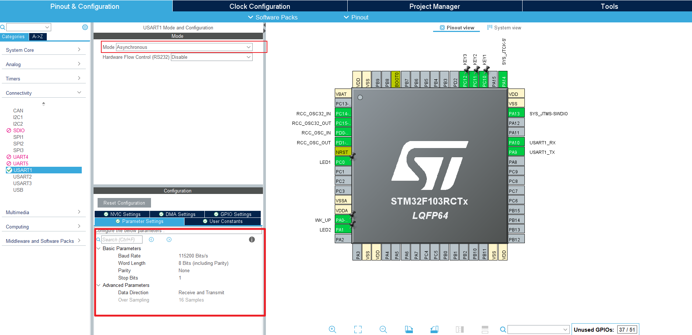

# 第6章 串口实验

本章视频： 

外设和硬件：

- 串口1

例程效果：

- 串口助手和STM32数据收发

## 5.1 工程配置

串口是STM32的内部外设，不需要使用任何其他硬件，但是和PC的串口工具通信需要USB转TLL的工具，开发板上已基础相关硬件，只需要正确设置跳线冒的位置即可。
本实验使用的串口1，在STM32CubeMX中只需要打开串口1，设置为`Asynchronous`模式，然后设置串口波特率，停止位，数据长度等参数，IO会默认设置的。



## 5.2 代码

### 5.2.1 配置代码
自动生成的按键部分串口部分配置代码
```c
// ./Core/Src/usart.c  部分代码


void MX_USART1_UART_Init(void)
{

  /* USER CODE BEGIN USART1_Init 0 */

  /* USER CODE END USART1_Init 0 */

  /* USER CODE BEGIN USART1_Init 1 */

  /* USER CODE END USART1_Init 1 */
  huart1.Instance = USART1;
  huart1.Init.BaudRate = 115200;
  huart1.Init.WordLength = UART_WORDLENGTH_8B;
  huart1.Init.StopBits = UART_STOPBITS_1;
  huart1.Init.Parity = UART_PARITY_NONE;
  huart1.Init.Mode = UART_MODE_TX_RX;
  huart1.Init.HwFlowCtl = UART_HWCONTROL_NONE;
  huart1.Init.OverSampling = UART_OVERSAMPLING_16;
  if (HAL_UART_Init(&huart1) != HAL_OK)
  {
    Error_Handler();
  }
  /* USER CODE BEGIN USART1_Init 2 */

  /* USER CODE END USART1_Init 2 */

}
```

### 5.2.2 串口收发代码
在PC上打开串口工具，就可以看到串口数据的收发
```c
// ./App/Src/app.c
/**
 * @brief 串口收发
 */
static void tx_and_rx_demo()
{
    uint8_t hello1[] = "Hello, blocking\n";
    HAL_UART_Transmit(&huart1, hello1, sizeof(hello1), 500);
    HAL_Delay(10);

    uint8_t hello2[] = "Hello, none blocking\n";
    HAL_UART_Transmit_IT(&huart1, hello2, sizeof(hello2));
    HAL_UART_Receive_IT(&huart1, rxBuffer, RX_CMD_LEN);
}

void app_main(void)
{
    tx_and_rx_demo();
    HAL_Delay(500);
    while (1) {
        printf("test\r\n");
        HAL_Delay(500);
    }
}

```

## 5.2 中断和DMA

TODO~~

## 5.3 串口重定向