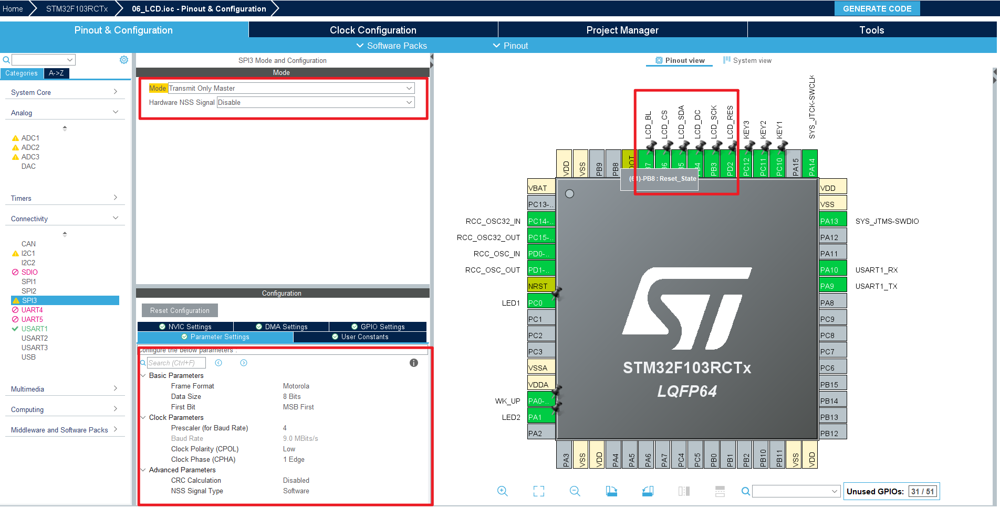

# 第7章 LCD驱动移植

本章视频： 

外设和硬件：

- SPI
- 1.69 LCD 资料：

例程效果：

- 板载的LCD显示字符

## 7.1 工程配置

### 7.1.1 LCD 
开发板上板载的LCD的规格是1.69 240*280, ST7789, 使用的是SPI通信。

### 7.1.2 工程配置
SPI 只需要主机发送数据，不需要读取数据，配置成`Transmit Only Master` 模式即可，片选信号设置为软件模式，其他控制引脚设置输出模式。



## 7.2 代码

### 7.2.1 配置代码
自动生成的SPI部分配置代码, 注意在用户代码中需要使能SPI发送
```c
// ./Core/Src/spi.c  部分代码

/* SPI3 init function */
void MX_SPI3_Init(void)
{

  /* USER CODE BEGIN SPI3_Init 0 */

  /* USER CODE END SPI3_Init 0 */

  /* USER CODE BEGIN SPI3_Init 1 */

  /* USER CODE END SPI3_Init 1 */
  hspi3.Instance = SPI3;
  hspi3.Init.Mode = SPI_MODE_MASTER;
  hspi3.Init.Direction = SPI_DIRECTION_2LINES;
  hspi3.Init.DataSize = SPI_DATASIZE_8BIT;
  hspi3.Init.CLKPolarity = SPI_POLARITY_LOW;
  hspi3.Init.CLKPhase = SPI_PHASE_1EDGE;
  hspi3.Init.NSS = SPI_NSS_SOFT;
  hspi3.Init.BaudRatePrescaler = SPI_BAUDRATEPRESCALER_4;
  hspi3.Init.FirstBit = SPI_FIRSTBIT_MSB;
  hspi3.Init.TIMode = SPI_TIMODE_DISABLE;
  hspi3.Init.CRCCalculation = SPI_CRCCALCULATION_DISABLE;
  hspi3.Init.CRCPolynomial = 10;
  if (HAL_SPI_Init(&hspi3) != HAL_OK)
  {
    Error_Handler();
  }
  /* USER CODE BEGIN SPI3_Init 2 */
    __HAL_SPI_ENABLE(&hspi3);
    SPI_1LINE_TX(&hspi3);
  /* USER CODE END SPI3_Init 2 */

}
```

### 7.2.2 驱动移植
在PC上打开串口工具，就可以看到串口数据的收发
```c
// ./App/Src/app.c
/**
 * @brief 串口收发
 */
static void tx_and_rx_demo()
{
    uint8_t hello1[] = "Hello, blocking\n";
    HAL_UART_Transmit(&huart1, hello1, sizeof(hello1), 500);
    HAL_Delay(10);

    uint8_t hello2[] = "Hello, none blocking\n";
    HAL_UART_Transmit_IT(&huart1, hello2, sizeof(hello2));
    HAL_UART_Receive_IT(&huart1, rxBuffer, RX_CMD_LEN);
}

void app_main(void)
{
    tx_and_rx_demo();
    HAL_Delay(500);
    while (1) {
        printf("test\r\n");
        HAL_Delay(500);
    }
}

```

### 7.2.3 测试代码


